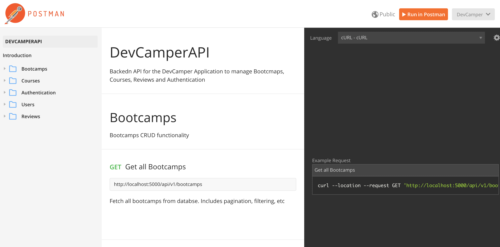

# 📖 Dev-Camper-API 📖

Backend API for DevCamper application, which is a bootcamp directory website

## Postman Docs

DevCamper Postman API documentation [here](https://documenter.getpostman.com/view/9366343/SWTK3ZQF?version=latest)



## Usage

Rename "config/config.env.env" to "config/config.env" and update the values/settings to your own

```bash
# Install Dependencies
$ npm install

# Run in dev mode
$ npm run dev

# Run in prod mode
$ npm start
```

## Database Seeder

To seed the database with users, bootcamps, courses and reviews with data from the "\_data" folder, run

```bash
# Destroy all data
node seeder -d

# Import all data
node seeder -i
```

## Config.env.env

Add your MongoDB and Geocoder api keys to a new file called `config.env` file

```javascript
MONGO_URI=

GEOCODER_PROVIDER=mapquest
GEOCODER_API_KEY=
```

## Built With

- [Node.js](https://nodejs.org/en/)
- [Express.js](https://expressjs.com/)
- [MongoDB](https://www.mongodb.com/)

Other Tools:

- [Postman](https://www.postman.com/)
- [mapquest](https://www.mapquest.com/)

## References

- [BradTraversy devcamper-api](https://github.com/bradtraversy/devcamper-api)
